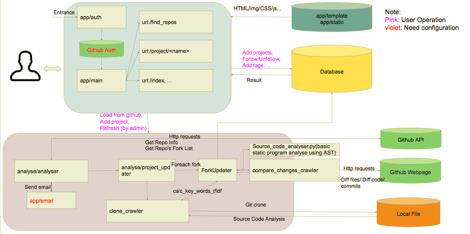
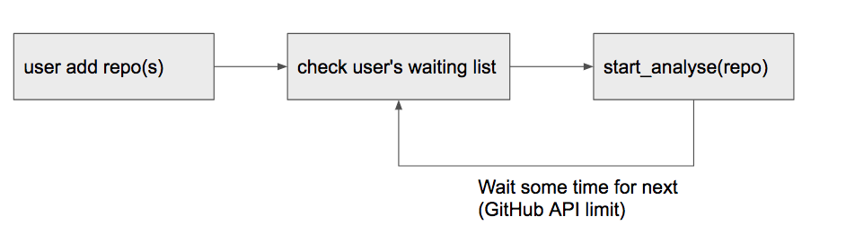
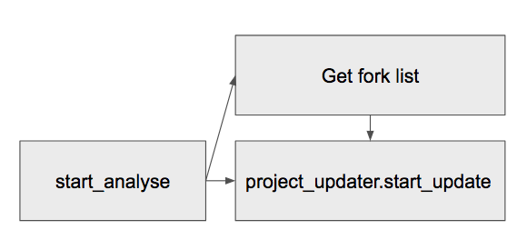

[](https://app.codacy.com/app/FancyCoder0/INFOX?utm_source=github.com&utm_medium=referral&utm_content=FancyCoder0/INFOX&utm_campaign=badger)
# INFOX [](https://travis-ci.org/FancyCoder0/INFOX)

Website: http://forks-insight.com

Another related repo: https://github.com/shuiblue/INFOX

 

Language: Python3

Framework: Flask

Database: mongo

Http server: uwsgi & nginx


# Quick Start:

1. Ramp up the environment according to environment.yaml(or requirements.txt)

   Here is an example of using Anaconda:

 - install conda (python3 version) [Download Anaconda](https://www.anaconda.com/download) 

 - install dependencies using [environment.yaml](https://github.com/FancyCoder0/INFOX/blob/master/environment.yaml)

   ``` bash
   conda env create -f environment.yaml
   source activate p3  (p3 is the env's name, see in environment.yaml)
   ```

2. Install mongodb & redis

3. Edit the config (see in [config.py](https://github.com/FancyCoder0/INFOX/blob/master/config.py)) & Set the environment variables

   1. Check the config.py

   2. ``` bash
         export GITHUB_CLIENT_ID=[your_github_oAuth_Client_ID]

         export GITHUB_CLIENT_SECRET=[your_github_oAuth_Client_Secret]

         export INFOX_LOCAL_DATA_PATH=[local path for storing analyzed result (like /Users/fancycoder/infox_data)]

         export INFOX_SECRET_KEY=[a random string(like abcd1234)]

         export INFOX_MAIL_USERNAME=[smtp_username]

         export INFOX_MAIL_PASSWORD=[smtp_password]
         ```

4. Run http server on localhost: 

   ```bash
   python manage.py runserver --threaded
   ```

5. Run worker for async crawling on localhost:
   ```bash
   celery worker -A celery_worker.celery --loglevel=info
   ```
   Use [flower](http://flower.readthedocs.io/en/latest/) to monitor the worker:
   ```bash
   celery flower --port=5555 --broker=redis://localhost:6379/0 --broker_api=redis://localhost:6379/0  
   ```

6. Deploy on server:

   An example: [Serve Flask Applications with uWSGI and Nginx on Ubuntu 16.04](https://www.digitalocean.com/community/tutorials/how-to-serve-flask-applications-with-uwsgi-and-nginx-on-ubuntu-16-04)


# Architecture Overview:




## Main Part

./app/main - Program Entrance

./app/analyse - Crawler 

./app/analyse/analyser.py - Start Crawler and do analysis, load result into database.

./app/analyse/compare_changes_crawler.py - comparing the diff bewteen two repos.

./app/analyse/clone_crawler.py - Download the source code for repo, prepare for calculation for keywords.

./models.py - Database Model

./app/auth - Logic about account

./app/templates - HTML files(related to ./app/main/views.py)

./app/static - CSS/Javascript/Img Resource

./app/tests - Basic Test

## Configuration Files

./config.py - Config for Flask

./config.ini - Config for using uWSGI

./wsgi.py - Start script for uwsgi

./celery_worker.py - Start script for crawler worker

./manage.py - Start script for testing

./requirements.txt - lib install for pip install

./environment.yaml - env for anaconda

## Crawler Part

Under ./app/analyse

./app/analyse/analyser.py is the entrance of crawler.

Following is the workflow.






